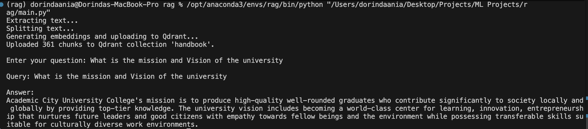

# AI-Powered Document Retrieval System
This project implements a Retrieval-Augmented Generation (RAG) pipeline that extracts information from a PDF document (the Academic City University Handbook) and provides summarized answers to user questions.
- **SentenceTransformers** for embedding
- **Qdrant** for vector storage and similarity search
- **Ollama (phi3:mini)** for answer generation
- **LangChain** for smart text splitting
- Custom cleaning for pre-processing text

  ## Table of Contents
1. [Project Overview](#project-overview)  
2. [Architecture](#architecture)
3. [Features](#features) 
4. [Workflow](#workflow)
5. [Folder Structure](#folder-structure)
6. [Technologies Used](#technologies-used)  
    

## Project Overview
This system allows users to query PDF documents and receive summarized answers generated by a local LLM.
It’s designed for academic and institutional use, for example, students can ask questions about a university handbook and get quick, reliable answers without reading the entire document.


---

## Architecture
1. **PDF Extraction:** Extracts text using pypdf.
2. **Text Cleaning:** Removes special characters, redundant spaces, and formatting.
3. **Chunking:** Splits text into manageable sections with LangChain’s RecursiveCharacterTextSplitter.
4. **Embedding:** Converts each chunk into numerical vectors using SentenceTransformer (all-MiniLM-L6-v2).
5. **Storage:** Uploads embeddings to a Qdrant Cloud collection.
6. **Retrieval:** Fetches the top relevant text chunks using vector similarity search.
7. **Generation:** Sends the retrieved context to Ollama (phi3) for natural language answer generation.

## Features
1. Extracts and processes large PDF documents
2. Retrieves contextually relevant information
3. Generates concise, human-like summaries
4. Uses local LLM via Ollama 

## Workflow
| Step | File | Description |
|--------|-------------|---------------|
| **1** | config.py | Loads environment variables and sets constants (API keys, collection name, file paths) |
| **2** | extractText.py | Extracts and splits PDF text into smaller chunks |
| **3** | embedUpload.py | Generates embeddings and uploads them to Qdrant |
| **4** | retrieveAnswer.py | Retrieves the most relevant text chunks and generates an answer using Ollama |
| **5** | main.py | Orchestrates the full RAG process and interacts with the user |

## Example 


## Folder Structure
```
project_root
├── config.py
├── extractText.py
├── embedUpload.py
├── retrieveAnswer.py
├── main.py
├── utils/
│   └── textCleaner.py
├── handbook.pdf
├── .env
└── README.md
```


## Technologies Used
1. LangChain — for text splitting and workflow organization
2. Sentence Transformers (all-MiniLM-L6-v2) — for embedding generation
3. Qdrant — vector database for semantic retrieval
4. Ollama (phi3) — local large language model for generation
5. PyPDF — PDF text extraction
6. dotenv — environment variable management


